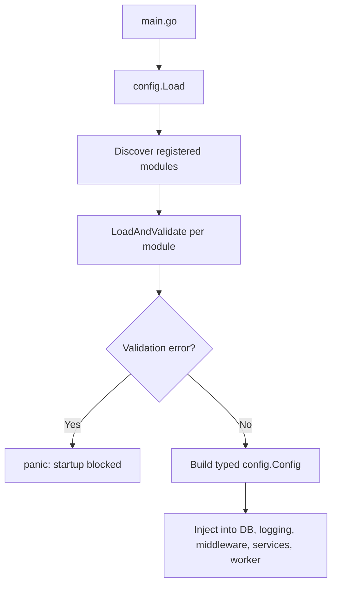
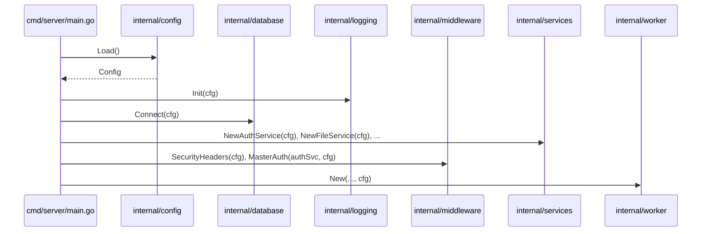

# Backend Config Service

## Purpose

The config service centralizes backend environment loading and validation in one place.
It is loaded once at startup (`config.Load()`), then injected into services, middleware, logging, database, and worker components.

## What Changed

A new config layer was added under `backend/internal/config/` with section-based modules:

- `app`
- `database`
- `http`
- `auth`
- `logging`
- `worker`
- `webhook`

Several components were updated to receive `config.Config` via dependency injection instead of reading `os.Getenv` directly:

- `database.Connect`
- `database.MigrateLegacyToMultitenant`
- `logging.Init`
- `middleware.MasterAuth`
- `middleware.SecurityHeaders`
- `handlers.SetIsProduction`
- `handlers.NewAuthHandlers`
- `services.NewAuthService`
- `services.NewFileService`
- `services.NewSettingsService`
- `services.NewWebhookStore`
- `services.NewUserAdminService`
- `worker.New`

## Load Flow





## Configuration Sections

| Section | Variables |
|---|---|
| `app` | `ENV` |
| `database` | `DATABASE_PATH`, `DB_HOST`, `POSTGRES_HOST`, `DATABASE_URL` |
| `http` | `ALLOWED_ORIGINS`, `PROXY_MODE` |
| `auth` | `AUTH_SESSION_TTL_HOURS`, `ALLOW_REGISTRATION`, `MASTER_PASSWORD`, `AUTH_COOKIE_SECURE_MODE` |
| `logging` | `LOG_LEVEL`, `LOG_FORMAT`, `LOG_FILE`, `LOG_MAX_SIZE`, `LOG_MAX_BACKUPS`, `LOG_MAX_AGE`, `LOG_COMPRESS` |
| `worker` | `BASE_URL` |
| `webhook` | `WEBHOOK_ALLOWLIST_HOSTS` |

Production validations:

- `DATABASE_PATH` is required when `ENV=production`.
- `ALLOWED_ORIGINS` is required when `ENV=production`.
- `ALLOWED_ORIGINS=*` is blocked in production unless `PROXY_MODE=simple`.

## How to Use

In `main.go`:

```go
cfg := config.Load()
```

Typical injection:

```go
authSvc := services.NewAuthService(cfg)
settingsSvc := services.NewSettingsService(cfg)
webhookStore := services.NewWebhookStore(cfg)

app.Use(middleware.SecurityHeaders(cfg))
mgmt := api.Group("/", middleware.MasterAuth(authSvc, cfg))
```

Runtime examples:

- `cfg.Database.Path` for SQLite path and upload paths.
- `cfg.Auth.SessionTTLHours` for session expiration.
- `cfg.Auth.CookieSecureMode` for secure cookie policy.
- `cfg.Worker.BaseURL` for quick-heartbeat links.
- `cfg.Webhook.AllowlistHosts` for webhook destination validation.
- `cfg.Logging.*` for level/format/rotation.

Convenience helpers:

- `cfg.IsProduction()`
- `cfg.AllowedOriginsOrDefault()`

## How to Extend

To add a new config section:

1. Create a module in `backend/internal/config/services/<name>_service.go`.
2. Implement `Name()`, `Section()`, and `LoadAndValidate()`.
3. Register the module with `common.Register(...)` in `init()`.
4. Add the section field to `Config` in `backend/internal/config/types.go` with `config:"<section>"`.
5. Add unit tests for the module and expected behavior.

Rule of thumb: if the section is critical in production, validate it in the module and return an error so startup is blocked.

## Common Errors

- Startup panic: usually a missing required variable in production.
- Unmapped section: `Section()` name does not match the `config:"..."` tag in `Config`.
- Type mismatch: `LoadAndValidate()` return type does not match the `Config` field type.
- Duplicate registration: two modules declare the same `Section()`.

## Why This Is Better

It removes configuration sprawl. Before this, defaults and parsing rules could diverge across packages.
Now there is a single typed contract.

It also fails early. Invalid runtime config is detected at boot, not during live requests.

Finally, it improves maintainability and testing. Each section is unit-tested, and the full loader behavior is tested end to end.
